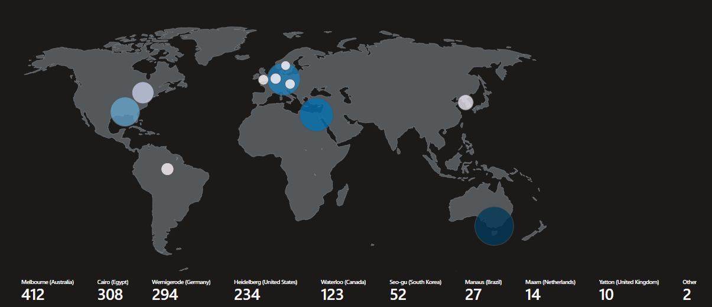
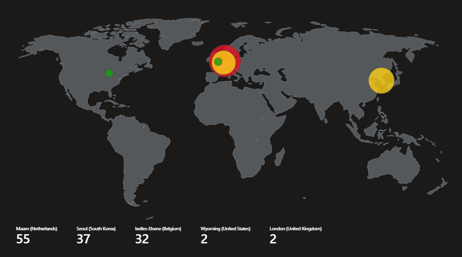
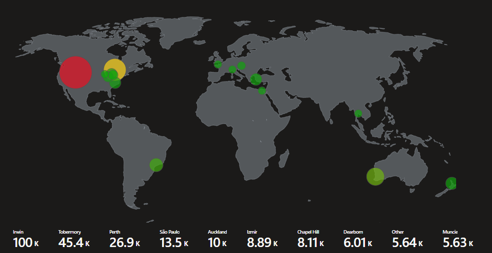
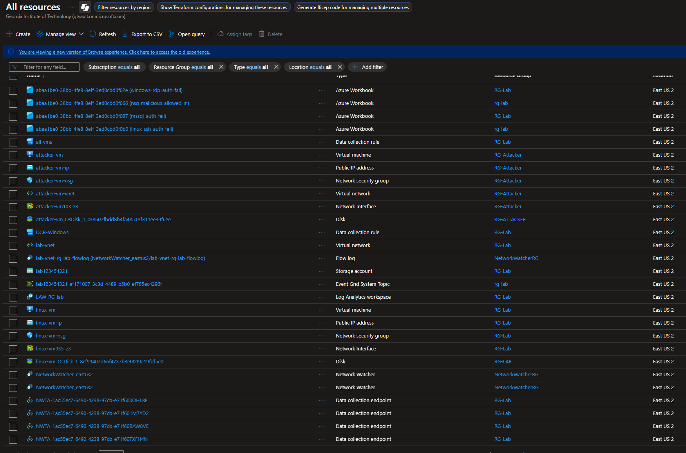
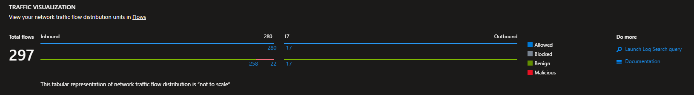
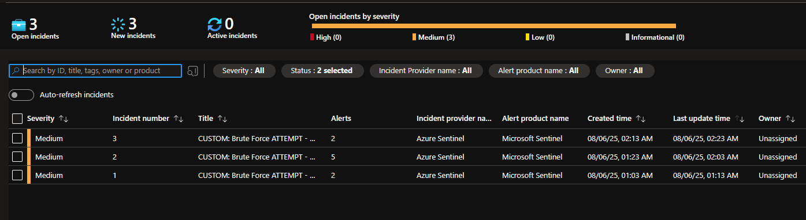

This project engineered a real-time SOC and honeynet environment in Microsoft Azure to demonstrate cloud-based threat defense. Multiple Windows and Linux virtual machines, along with an SQL Database, were deployed within a secured Virtual Network and monitored via an Azure Log Analytics Workspace and Azure Key Vault. Logs from all resources—including Security Events, Syslog, and network activity—were ingested and analyzed in Microsoft Sentinel (SIEM) for automated detection of malicious activity, alerting, and incident response. Security metrics were collected before and after applying advanced security controls, showing a drastic reduction in threats, security incidents, and malicious flows post-hardening. The solution leveraged KQL queries for metric tracking, validating the effectiveness of layered defense with Azure-native tools.

